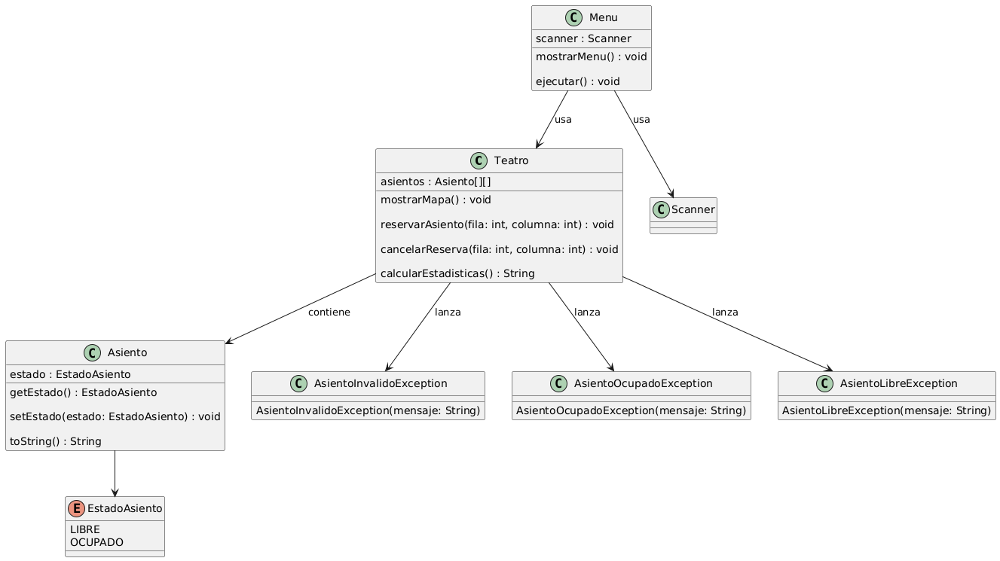

# Sistema de Reservas de Asientos para Teatro

Este documento describe un sistema profesional de reservas desarrollado en Java, orientado a satisfacer los requerimientos de una empresa que gestiona boletería digital para teatros. La solución ha sido diseñada bajo principios de arquitectura limpia y separación de responsabilidades, utilizando programación orientada a objetos, excepciones personalizadas y estructuras matriciales eficientes.

---

## Objetivo del Proyecto

Diseñar e implementar un sistema robusto para la gestión de reservas de asientos en una sala de teatro. El sistema debe permitir operaciones de consulta, reserva y cancelación, manteniendo integridad de datos, control de errores y experiencia fluida en consola.

---

## Alcance Funcional

Una empresa especializada en espectáculos necesita automatizar el proceso de reserva de asientos en sus salas. La primera versión de este software debe operar en entorno de consola y permitir la gestión de una única sala con 10 filas y 6 columnas de asientos (60 en total).

El sistema debe ofrecer el siguiente menú de funcionalidades:

1. Visualización del mapa de asientos (Libre u Ocupado)
2. Registro de una reserva de asiento específica
3. Cancelación de una reserva previamente hecha
4. Consulta de estado de ocupación general (libres, ocupados y porcentaje)
5. Salida del sistema

 Reglas de negocio clave:
- Identificación de asientos por coordenadas (ej. F2-C4).
- Control de errores para coordenadas fuera de rango.
- Prevención de doble reserva y cancelación de asientos libres.
- Solo el componente de presentación (Menu) tiene contacto con el usuario final a través de consola.

---

## Arquitectura de Componentes

- Teatro: motor del sistema, gestiona estado y lógica de asientos.
- Asiento: entidad que representa cada unidad reservable.
- EstadoAsiento (enum): define si un asiento está LIBRE u OCUPADO.
- Menu: interfaz de consola que permite la interacción.
- Excepciones personalizadas:
  - AsientoInvalidoException
  - AsientoOcupadoException
  - AsientoLibreException

---

## Diagrama UML del proyecto

